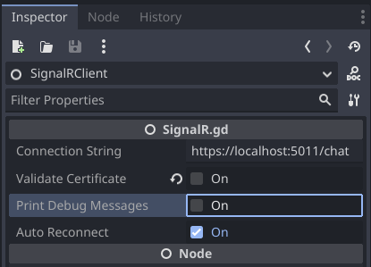
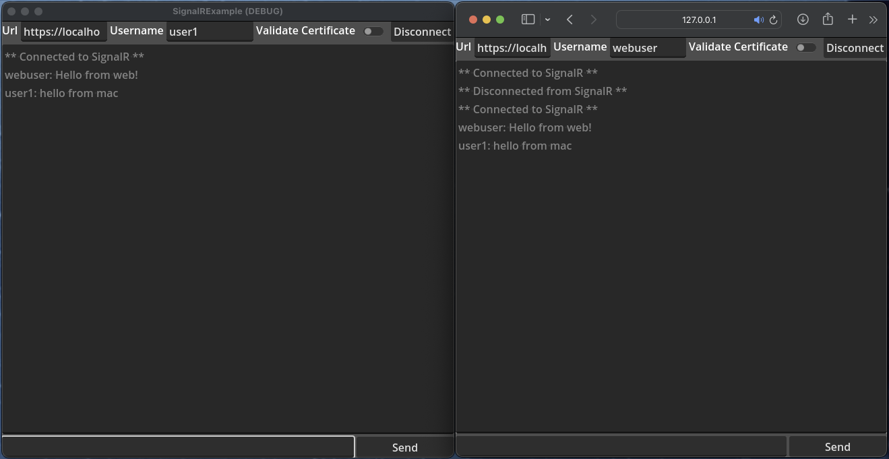

# Godot SignalR implementation in GDScript

This is an example implementation of how to connect to a SignalR server using Godot 4.1.1-stable and GDScript. It currently only supports communication over WebSocket. Long polling and Server Events is currently not supported.

The example projects implements the examples used in SignalR and the ChatHub [link](https://learn.microsoft.com/en-us/aspnet/core/tutorials/signalr?view=aspnetcore-7.0&tabs=visual-studio-code). Make sure you have necessary CORS settings in your server to allow the client to connect if using web.

## Usage
Import the SignalRClient scene into your scene. Connection information can either be set in the editor or in code.



```gdscript

@onready var signalr_client = $SignalRClient

func _ready():
    signalr_client.connection_string = "https://signalr-host/hub-name"
```

If the connection is successful, the client will emit the `connected` signal.

The example project builds a chat client similar to the one in the SignalR tutorial. The client can send messages to the server and receive messages from other clients.



## Signals available
```gdscript
signal connected()
signal disconnected(code:int, reason: String)
signal reconnecting(attempt: int)
signal message_received(message: Dictionary)
```

## Methods available
```gdscript
# Connect to the SignalR server
$SignalRClient.connect_to_signalr() 

# Disconnect from the SignalR server
$SignalRClient.disconnect_from_signalr() 

#Send a message to the server. Target is the name of the method to call on the server. Arguments is an array of arguments to pass to the method.
$SignalRClient.send_message(target: String, arguments: Array) 
```